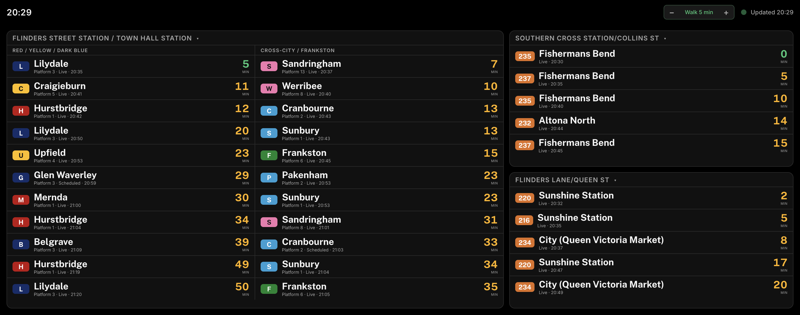
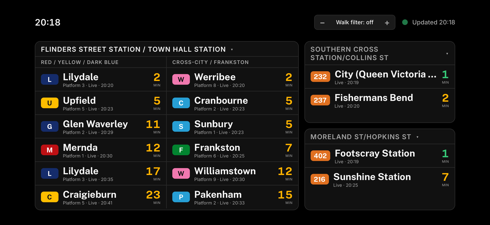
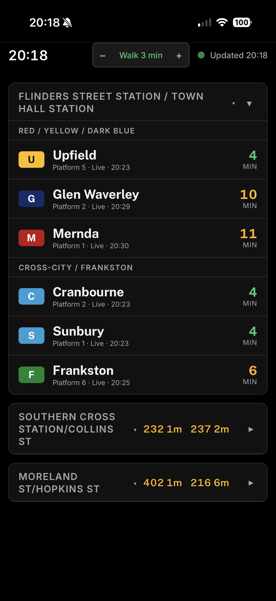

# Melbourne Departures Board

A real-time departures board for Melbourne's public transport network, styled after the PIDS displays that hang over train platforms. It shows live train and bus departures for any metro station, refreshes every 45 seconds, and adapts from a wall-mounted display down to a phone screen.

Built with TypeScript on Cloudflare Workers and D1, running entirely on free tiers with no ongoing hosting cost.

**Live demo: [ptv-display.josephforanu.workers.dev](https://ptv-display.josephforanu.workers.dev/)**



---

## What it does

- **Live departures** from the Public Transport Victoria (PTV) Timetable API, with real-time estimates where available and scheduled times where they are not.
- **Direction-split train departures** driven by station classification, so a suburban station, a City Loop station, and a Metro Tunnel station each split the board the way that station actually works.
- **Any of 226 metro train stations**, searchable, with physically paired stations (Flinders Street with Town Hall, Melbourne Central with State Library) merged into a single board.
- **Two configurable bus stops**, searchable across 16,012 metro bus stops with route numbers shown inline to help pick the right pole.
- **Walk filter** that hides departures you could not physically reach, tunable in place from 0 to 15 minutes.
- **Responsive layout**: a two column ambient board in landscape for an always-on display, and a compact decision view in portrait for checking before you leave the house.
- **Screen Wake Lock** so a spare phone can run the board indefinitely without sleeping.

## Screenshots

| Phone, landscape | Phone, portrait |
| :--- | :--- |
|  |  |

## Why I built it

I live near Footscray Station and wanted a genuinely useful home display. I also wanted a project that exercised the parts of backend and cloud engineering I care about: integrating a real third-party API, handling authentication and caching correctly, modelling messy domain data in a relational schema, and making pragmatic product decisions when the data does not behave the way you would like.

## Architecture

A single Cloudflare Worker serves both the API and the static frontend, backed by a D1 database holding network reference data.

```
Browser  ──►  Cloudflare Worker  ──►  PTV Timetable API v3
                    │                  (HMAC-SHA1 signed)
                    ├──►  D1: station and stop reference data
                    └──►  Edge cache (45s per board configuration)
```

**Worker (TypeScript)**

| Endpoint | Purpose |
| :--- | :--- |
| `GET /api/board?station=&bus1=&bus2=` | Departures for one train station and two bus stops, merged into a single payload |
| `GET /api/stations` | Picker-ready station list with paired stations collapsed |
| `GET /api/stops/search?q=` | Ranked bus stop search, capped at 20 results |

**D1 database** holds slow-changing reference data imported from the PTV API by two one-off scripts:

| Table | Rows | Contents |
| :--- | ---: | :--- |
| `stations` | 226 | Metro train stations with coordinates and a `station_type` classification |
| `routes` | 507 | Train and bus routes |
| `station_routes` | 356 | Station to route mapping |
| `bus_stops` | 16,012 | Metro bus stops with coordinates and suburb |
| `bus_stop_routes` | 25,491 | Stop to route mapping |

**Frontend** is compiled TypeScript with no framework or build tooling beyond `tsc`. It renders the board, recomputes countdowns between fetches so times stay honest, and persists station selection, bus stops, and walk preference per device in local storage. A wall display and a phone can therefore show entirely different configurations from the same deployment.

## Engineering highlights

**Request signing in the Workers runtime.** PTV requires an HMAC-SHA1 signature over the request path. Workers do not run Node, so this uses the Web Crypto API's `SubtleCrypto` rather than Node's `crypto` module.

**Database-driven display logic.** Direction-splitting started as a hardcoded per-station config, which does not scale past a handful of stations. It is now driven by a `station_type` column with nine values (`through`, `interchange`, `terminus`, `loop`, `tunnel_north`, `tunnel_south`, and three CBD city loop specials). Adding a station is a database row, not a code change. Terminus stations render as a single list rather than an empty second column.

**Edge caching as rate-limit protection.** The Worker caches each board configuration for 45 seconds. Client refresh frequency is decoupled from upstream API usage, which is what makes the free-tier constraint hold: many viewers on the same configuration collapse into one PTV call.

**Search that scales to the bus network.** Shipping 16,012 stops to the client is not viable, so bus search runs server-side in D1. The client's subsequence matching (every typed character appearing in order) translates to an interleaved SQL `LIKE` pattern, with results ranked prefix, then substring, then subsequence, so a three character query returns something useful rather than noise. Input is debounced at 500ms and `LIKE` metacharacters are escaped per character.

**Timezone correctness.** The API returns UTC. Melbourne observes daylight saving, so display times and countdowns are computed in the `Australia/Melbourne` timezone rather than by fixed offset. This is the kind of detail that quietly breaks a board twice a year.

**Layout that fills the space honestly.** The board renders as many departures as fit, then measures and trims any row that would be clipped, so it is always full but never shows a half-cut row. It refits on resize and orientation change.

## Product decisions

A few places where I chose the honest option over the impressive-sounding one.

**Removed V/Line services after integrating them.** V/Line departures were available, but the data was too sparse for a dependable display: no real-time estimates, inconsistent platform information, and undocumented fields. Rather than ship something misleading, I cut it. Investigating an undocumented `flags` field by cross-referencing two endpoints was still a useful exercise in reasoning about unclear third-party behaviour.

**Bus stops are two fixed slots, not an arbitrary list.** A bus stop ID identifies a single pole serving a single direction, so the picker needs no direction logic. Two slots keep the landscape grid stable and match how the board is actually used.

**Stripped metadata at small sizes.** On a phone, line colour plus destination plus countdown communicates more than a row crowded with platform numbers and status text.

## Tech stack

| Layer | Technology |
| :--- | :--- |
| Language | TypeScript |
| Compute | Cloudflare Workers |
| Database | Cloudflare D1 (SQLite) |
| Static assets | Workers Static Assets |
| Data source | PTV Timetable API v3 |
| Web platform | Web Crypto, Screen Wake Lock, local storage |
| Tooling | Wrangler CLI, `tsc` |
| Type | Public Sans (display), Inter (interface) |

## Running it yourself

Requires Node 18+ and a free PTV API key, available on request from Public Transport Victoria.

```bash
npm install

# Local credentials (never commit this file)
cp .dev.vars.example .dev.vars   # then add your own PTV_DEV_ID and PTV_API_KEY

# Create and populate the database
npx wrangler d1 execute ptv-db --local --file=./schema.sql
npx wrangler d1 execute ptv-db --local --file=./schema-bus.sql
PTV_DEV_ID=xxx PTV_API_KEY=xxx node import-stations.mjs
PTV_DEV_ID=xxx PTV_API_KEY=xxx node import-bus-stops.mjs

npm run dev
```

To deploy, repeat the schema and import steps with `--remote`, then:

```bash
npx wrangler secret put PTV_DEV_ID
npx wrangler secret put PTV_API_KEY
npm run deploy
```

## Roadmap

- **Hardware display.** Driving a small networked screen (GeekMagic SmallTV) or an e-ink panel from the existing API via a lightweight image renderer.
- **iOS StandBy widget.** A native WidgetKit and SwiftUI client against the same endpoints.
- **Departures data warehouse.** Logging scheduled against actual departure times to build a historical dataset.
- **Delay analysis.** Using that dataset to surface recurring delays and explore a simple predictive model for which services tend to run late.
- **Route mapping** between different mode of transport and different lines.

---

Built by Joseph. Feedback and questions welcome.